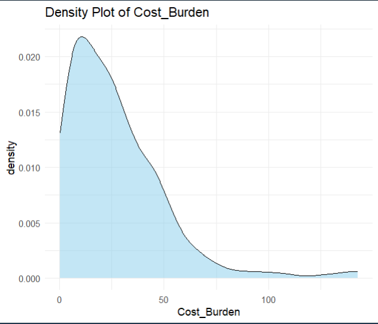
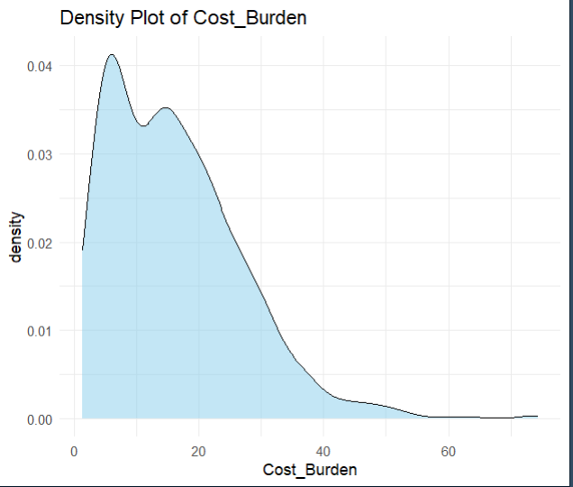
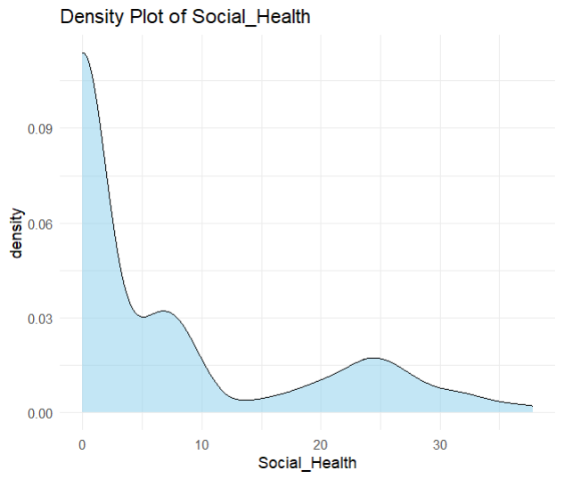
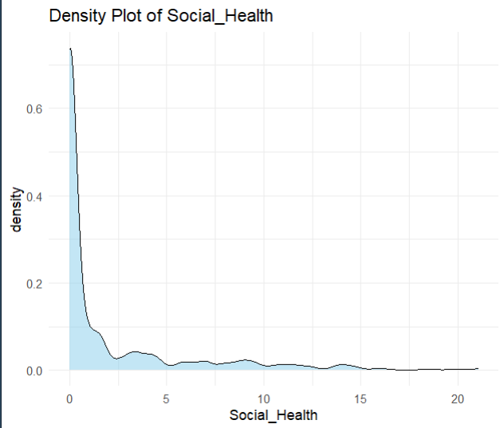
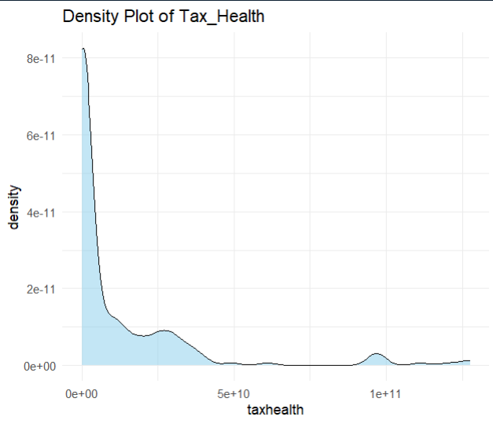
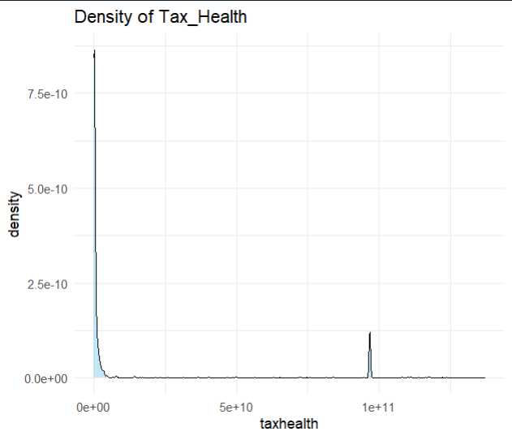
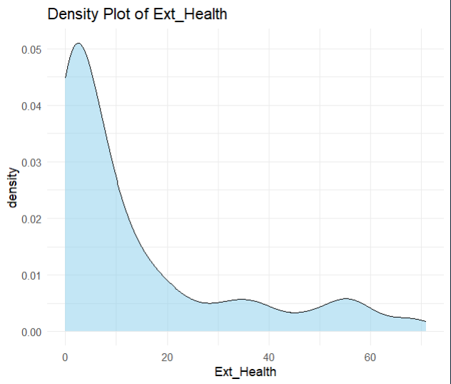
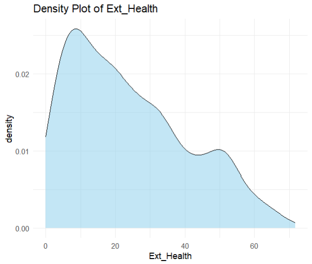
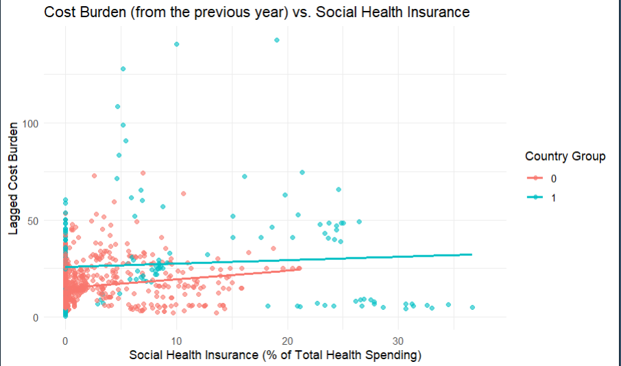
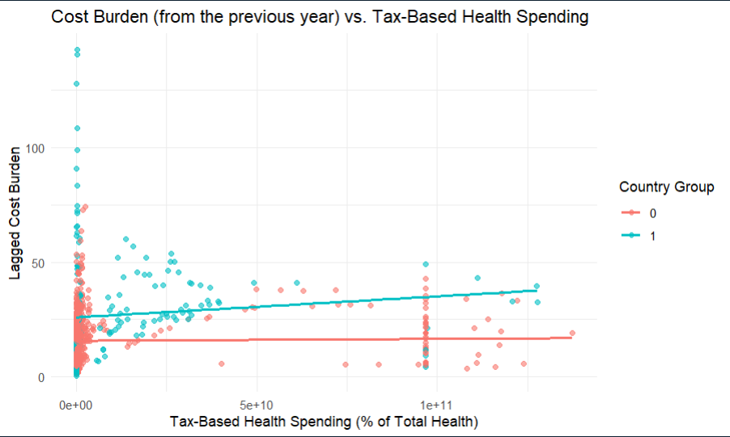

# Universal Health Care in Developed vs Developing Countries: A Broad Cross-Country Analysis

**Course:** ECON 498 H — Concordia University
**Author:** Srimayee Agnihotram
**Date:** April 2025

---

## Table of Contents

1. [Research Question](#research-question)
2. [Abstract](#abstract)
3. [Data Sources](#data-sources)
4. [Data Wrangling & Merging Strategy](#data-wrangling--merging-strategy)
5. [Exploratory Data Analysis](#exploratory-data-analysis)
6. [Methodology & Model Specifications](#methodology--model-specifications)
7. [Results](#results)
8. [Robustness Checks](#robustness-checks)
9. [Repository Structure](#repository-structure)
10. [How to Reproduce](#how-to-reproduce)
11. [Citation](#citation)

---

## Research Question

> How do different financing mechanisms of Universal Health Coverage (UHC) affect household-level affordability in developed vs. developing countries?

---

## Abstract

The Universal Healthcare Coverage (UHC) policy is a tool aimed to achieve the 3rd Sustainable Development Goal (SDG 3), yet progress has stagnated since 2015 (a mere ~3-point increase in the UHC index). Over 1 billion people still face catastrophic health expenditures. This study conducts a comparative cross-country analysis of **73 countries from 2000 to 2022**, examining how two major public financing mechanisms — social health insurance (SHI) contributions and tax-based health expenditure — affect a constructed household financial cost burden metric. The model includes foreign aid, year, and regional fixed effects to account for domestic capacity and geographic heterogeneity in UHC implementation.

---

## Data Sources

All data is publicly available:

1. **WHO Global Health Expenditure Database** — Current Health Expenditure (CHE) per capita, Out-of-Pocket Expenditure (OOP) per capita, Voluntary Health Insurance (VHI) as % of CHE, Social Health Insurance (SHI) as % of CHE, External Health Expenditure (EXT) as % of CHE
   → [apps.who.int/nha/database](https://apps.who.int/nha/database)

2. **World Bank World Development Indicators** — Government tax revenue (LCU), grants and other revenue (LCU), domestic general government health expenditure (GGHE) per capita PPP, total population
   → [data.worldbank.org](https://data.worldbank.org)

> **Sample Filter:** Countries where the cost burden was below 50% of CHE in *both* 2021 and 2022 were retained, yielding a final panel of **73 countries**.

---

## Data Wrangling & Merging Strategy

The data pipeline spans two main scripts: [`Tax-Variable-Revised.R`](scripts/Tax-Variable-Revised.R) and [`Empirical-Analysis-Revised.R`](scripts/Empirical-Analysis-Revised.R). Exploratory stochastic frontier analysis (SFA) is in [`SFA-Analysis.R`](scripts/SFA-Analysis.R).

### Step 1 — Constructing the Cost Burden Variable (`Empirical-Analysis-Revised.R`)

Raw WHO NHA indicators are stored in wide format (one column per year). The cleaning pipeline:

1. **Pivot to long** — `pivot_longer()` collapses all year columns into a single `Year` column.
2. **Pivot to wide** — `pivot_wider()` reshapes `Indicators` into separate variable columns (OOP, VHI, SHI, EXT, CHE).
3. **Type conversion** — All health spending columns are cast to `numeric`.
4. **Composite variable** — The financial cost burden index is constructed as:

```
Cost_Burden = OOP (as % of CHE) + VHI (as % of CHE)
```

This proxies the share of health spending borne directly by households (out-of-pocket payments plus voluntary premiums).

5. **Renaming** — `Social Health Insurance (SHI) as % of CHE` → `Social_Health`; `External Health Expenditure (EXT) as % of CHE` → `Ext_Health`.
6. **Sample filter** — Countries where `Cost_Burden < 50` in both 2021 and 2022 are retained (73 countries).

### Step 2 — Constructing the Tax-Based Health Expenditure Variable (`Tax-Variable-Revised.R`)

The tax health variable is not directly available and requires merging multiple World Bank datasets:

| Dataset | Indicator | Unit |
|---|---|---|
| `API_GC_TAX_TOTL` | Tax Revenue | Current LCU |
| `API_GC_REV_GOTR` | Grants and Other Revenue | Current LCU |
| `API_SH_XPD_GHED` | GGHE per capita (PPP) | Current international $ |
| `API_SP_POP_TOTL` | Total Population | — |

**Pipeline:**

1. Each World Bank dataset is pivoted from wide to long (year columns → `Year`) then to wide (indicator names → variable columns).
2. `TaxRev` and `OtherRev` are joined on `(Country Name, Country Code, Year)` to form `TotalRev`.
3. **General Government Expenditure (GGE)** is computed as:

```
GGE = Tax Revenue (LCU) + Grants and Other Revenue (LCU)
```

4. `gghepercapita_final` and `totalpop_final` are joined to form `TotalExp`.
5. **Aggregate GGHE** is recovered from per-capita figures:

```
AggGGHE = GGHE per capita (PPP) x Total Population
```

6. **Tax health variable** is derived as the tax-funded share of total government health spending:

```
taxhealth = AggGGHE x Tax Revenue (LCU) / GGE
```

7. Missing values in numeric columns are imputed with **column means** throughout.

### Step 3 — Final Merge

`HealthBurden_final` (WHO) and `TotalExp` (World Bank) are left-joined on `(Country Name, Year)` to produce `Final_Data`, the master dataset for all regressions.

### Step 4 — Income Classification & Fixed Effects (`SFA-Analysis.R`)

Country income groups and regions are assigned using `countrycode` and the `wbstats` package:

- **Developed:** High income + Upper middle income
- **Developing:** Lower middle income + Low income
- **Regions:** Latin America & Caribbean, Sub-Saharan Africa, Europe & Central Asia, East Asia & Pacific, South Asia, Middle East & North Africa, Southeast Asia, Oceania, North America (base category)

Some East Asian and Oceania countries were manually reclassified to correct `countrycode` defaults (e.g., CN, JP, KR → "East Asia"; AU, NZ → "Oceania").

---

## Exploratory Data Analysis

The figures below were generated with [`Visualization.R`](scripts/Visualization.R) and [`SFA-Analysis.R`](scripts/SFA-Analysis.R).

### Cost Burden Distribution

| Developed Countries | Developing Countries |
|---|---|
|  |  |

The cost burden distribution is notably right-skewed in developing countries, with a larger mass at higher out-of-pocket shares. Developed countries show a tighter distribution around lower burden values.

### Social Health Insurance (SHI) Distribution

| Developed Countries | Developing Countries |
|---|---|
|  |  |

SHI contributions are substantially higher in developed countries, consistent with the presence of established social insurance systems (e.g., Germany, France, Japan). In developing countries the distribution is concentrated near zero.

### Tax-Based Health Expenditure Distribution

| Developed Countries | Developing Countries |
|---|---|
|  |  |

### External Health Aid Distribution

| Developed Countries | Developing Countries |
|---|---|
|  |  |

External aid is negligible for developed countries but represents a meaningful financing source for lower-income countries.

### SHI vs. Tax Health Cross-Plot

| Developed Countries | Developing Countries |
|---|---|
|  |  |

In developed countries there is a negative relationship between SHI and tax-based funding, consistent with institutional substitution (countries with large payroll-funded insurance rely less on general taxation). In developing countries the relationship is flatter, reflecting weaker institutional differentiation.

---

## Methodology & Model Specifications

### Estimator

Ordinary Least Squares (OLS) panel regression in levels. Log-transformation was infeasible for several variables due to structural zeros or missingness.

**Year fixed effects** are included as factor dummies. **Regional fixed effects** are included as binary dummies with North America as the omitted base category. All models are estimated **separately** for developed and developing subsamples.

---

### Variables

| Variable | Description | Source |
|---|---|---|
| `Cost_Burden` | OOP (% CHE) + VHI (% CHE) — household financial burden index | WHO NHA |
| `Social_Health` | Social Health Insurance contributions as % of CHE | WHO NHA |
| `taxhealth` | Tax-funded share of GGHE (constructed; see Data Wrangling) | WB WDI + WHO |
| `Ext_Health` | External/donor health expenditure as % of CHE | WHO NHA |
| `Year` | Year fixed effects (factor, base = 2000) | — |
| `LatinAmerica` ... `MiddleEast` | Regional dummies (base = North America) | WB / countrycode |
| `Developed` | 1 = High/Upper-middle income, 0 = otherwise | WB wbstats |

### Dependent Variable Construction

```
Cost_Burden = OOP (% CHE) + VHI (% CHE)
```

OOP is out-of-pocket expenditure as % of CHE; VHI is voluntary health insurance payments as % of CHE. Together they capture the share of health spending borne directly by households.

### Tax Health Variable Construction

```
GGE       = Tax Revenue (LCU) + Grants and Other Revenue (LCU)
AggGGHE   = GGHE per capita (PPP) x Total Population
taxhealth = AggGGHE x Tax Revenue (LCU) / GGE
```

---

### Model 1 — Social Health Insurance Only

Estimated separately for **developed** and **developing** subsamples:

```
Cost_Burden[it] = B0 + B1*Social_Health[it] + B2*Ext_Health[it]
                + sum(Dr*Region[i]) + sum(Gt*Year[t]) + e[it]
```

- **B1** captures the direct effect of SHI intensity on household cost burden.
- **B2** captures the protective or crowd-out effect of foreign health aid.
- Base region: North America.

---

### Model 2 — Tax-Based Health Expenditure Only

```
Cost_Burden[it] = B0 + B1*taxhealth[it] + B2*Ext_Health[it]
                + sum(Dr*Region[i]) + sum(Gt*Year[t]) + e[it]
```

- **B1** captures the effect of the tax-funded component of government health spending on household burden.

---

### Model 3 — Both Mechanisms with Interaction

```
Cost_Burden[it] = B0 + B1*taxhealth[it] + B2*Social_Health[it] + B3*Ext_Health[it]
                + B4*(Social_Health[it] x taxhealth[it])
                + sum(Dr*Region[i]) + sum(Gt*Year[t]) + e[it]
```

- **B4** tests whether SHI and tax funding act as **complements** (B4 < 0: combined burden-reducing effect exceeds individual effects) or reflect **fragmented systems** (B4 > 0: administrative overlap or institutional mismatch raises burden).

### Robustness Specification — Lagged Dependent Variable

To diagnose reverse causality, each financing mechanism is regressed on its own lagged cost burden:

```
FinancingMechanism[it] = A0 + A1*Cost_Burden[i,t-1] + sum(Gt*Year[t]) + e[it]
```

A positive and significant A1 indicates that higher past household burden predicts greater current financing effort, consistent with policy response rather than financing causing burden.

---

## Results

### Table 1: Cost Burden vs. Social Health Insurance (Model 1)

| Regressor | Developed | Developing |
|---|---|---|
| Intercept | -0.090 (1.273) | 16.172\*\*\* (0.337) |
| **Social Health (B1)** | **1.546\*\*\* (0.037)** | **0.171\*\*\* (0.018)** |
| Ext. Health (B2) | 0.007 (0.027) | -0.301\*\*\* (0.004) |
| N | 4,968 | 20,976 |
| R-squared | 0.584 | 0.365 |

*Standard errors in parentheses. \* p<0.05, \*\* p<0.01, \*\*\* p<0.001. Regional and year fixed effects included.*

**Interpretation:**
- A 1 percentage point increase in SHI (as % of CHE) is associated with a **+1.546 pp** increase in cost burden among developed countries and **+0.171 pp** in developing countries.
- The large positive coefficient in developed countries is counterintuitive and likely reflects **reverse causality**: countries with persistently high household burden invest more in SHI as a policy response (confirmed by the robustness checks below).
- External aid has a significant **protective effect** in developing countries (-0.301 pp per 1 pp increase) but is statistically insignificant in developed economies, where external aid is negligible.
- The much higher intercept for developing countries (16.17 vs -0.09) reflects the substantially larger baseline cost burden in lower-income settings.

---

### Table 2: Cost Burden vs. Taxation (Model 2)

| Regressor | Developed | Developing |
|---|---|---|
| Intercept | -1.229\*\*\* (0.094) | -0.639\*\*\* (0.023) |
| **Tax Health (B1)** | **0.017 (0.057)** | **0.090\*\*\* (0.005)** |
| Ext. Health (B2) | -0.330\*\*\* (0.037) | -0.393\*\*\* (0.005) |
| N | 4,968 | 20,976 |
| R-squared | 0.437 | 0.397 |

*Standard errors in parentheses. \* p<0.05, \*\* p<0.01, \*\*\* p<0.001. Regional and year fixed effects included.*

**Interpretation:**
- Tax-based health expenditure has **no statistically significant effect** on cost burden in developed countries (B1 = 0.017, p > 0.05), possibly because developed systems are already sufficiently funded through multiple channels.
- In developing countries, a 1-unit increase in tax-funded GGHE is associated with a small **+0.090 pp** increase in cost burden — consistent with reverse causality or capacity constraints where higher taxation has not yet translated into better household protection.
- External health aid has a significant **protective effect** in *both* subsamples: -0.330 pp (developed) and -0.393 pp (developing) per unit increase, making it a more consistently protective instrument than either domestic mechanism alone.
- Model 2 achieves a better fit for developing countries (R-squared = 0.397) than Model 1 (R-squared = 0.365), suggesting taxation is a more relevant predictor in lower-income settings.

---

### Table 3: Cost Burden vs. Both Mechanisms + Interaction (Model 3)

| Regressor | Developed | Developing |
|---|---|---|
| Intercept | -0.608\*\*\* (0.081) | 0.101 (0.123) |
| **Tax Health (B1)** | **0.527\*\*\* (0.050)** | **0.661\*\*\* (0.173)** |
| **Social Health (B2)** | **0.654\*\*\* (0.015)** | **-0.265\*\*\* (0.046)** |
| Ext. Health (B3) | 0.057\*\*\* (0.032) | -0.345\*\*\* (0.034) |
| **Tax x Social Health (B4)** | **-0.039\*\*\* (0.012)** | **0.068 (0.153)** |
| N | 4,968 | 20,976 |
| R-squared | 0.595 | 0.330 |

*Standard errors in parentheses. \* p<0.05, \*\* p<0.01, \*\*\* p<0.001. Regional and year fixed effects included.*

**Interpretation:**
- In **developed countries**, the negative interaction term (B4 = -0.039, p < 0.001) indicates that SHI and tax-based funding are **complements**: simultaneously expanding both mechanisms produces a burden-reducing effect beyond the sum of their individual effects. This is consistent with integrated, multi-pillar health systems where payroll insurance and general taxation reinforce each other.
- In **developing countries**, the interaction is positive but statistically insignificant (B4 = 0.068, p > 0.05), suggesting **fragmented or siloed** administration — expanding both funding streams does not reduce burden synergistically, possibly due to weak institutional coordination and high administrative overhead.
- Social Health switches sign across subsamples: **+0.654 in developed** vs **-0.265 in developing** countries. In developing countries with low baseline SHI, marginal increases in SHI coverage appear to substitute for direct out-of-pocket spending, whereas the reverse-causality dynamic dominates in developed countries.
- Model 3 achieves the highest R-squared for developed countries (0.595), confirming that joint consideration of financing mechanisms better explains cost burden heterogeneity.

---

## Robustness Checks

To test for **reverse causality** — the concern that higher household cost burden drives governments to expand SHI or taxation rather than vice versa — lagged cost burden models are estimated (Appendix C of the paper).

### Table 4: Lagged Cost Burden Models

| | Dev. — SHI | Dev. — Tax | Dping. — SHI | Dping. — Tax |
|---|---|---|---|---|
| Intercept | 0.043 (0.389) | -0.561\*\*\* (0.023) | 0.418\*\* (0.136) | 0.037 (0.031) |
| **CB lag (A1)** | **0.178\*\*\* (0.004)** | **0.003 (0.004)** | **0.055\*\*\* (0.002)** | **-0.048\*\*\* (0.008)** |
| Year 2001 | 0.218 (0.508) | 0.003 (0.029) | -0.043 (0.159) | 0.001 (0.037) |
| Year 2006 | -1.699\*\*\* (0.509) | 0.076\*\* (0.029) | -0.281 (0.159) | 0.025 (0.037) |
| Year 2011 | -2.729\*\*\* (0.512) | 0.147\*\*\* (0.029) | -0.490\*\* (0.160) | -0.025 (0.037) |
| Year 2016 | -0.610\*\* (0.508) | 0.270\*\*\* (0.029) | -0.561\*\*\* (0.160) | 0.006 (0.038) |
| Year 2021 | -1.353\*\* (0.509) | 0.464\*\*\* (0.029) | -0.600\*\* (0.160) | -0.058 (0.038) |
| Year 2022 | -1.282\* (0.509) | 3.635\*\*\* (0.029) | -0.626\*\* (0.165) | 3.282\*\*\* (0.038) |
| N | 4,959 | 4,959 | 20,938 | 20,938 |
| R-squared | 0.584 | 0.437 | 0.365 | 0.380 |

*Standard errors in parentheses. \* p<0.05, \*\* p<0.01, \*\*\* p<0.001.*

**Interpretation:**
- **Developed countries — SHI:** A 1 pp increase in *lagged* cost burden predicts a **+0.178 pp** increase in current SHI contributions (A1 = 0.178, p < 0.001). This is strong evidence of reverse causality: high household burden in the previous period triggers expanded social insurance investment.
- **Developed countries — Tax:** The lagged burden has no significant effect on current tax health expenditure (A1 = 0.003, p > 0.05), suggesting tax allocation decisions follow fiscal cycles rather than direct household burden signals.
- **Developing countries — SHI:** The lag effect is positive but smaller (A1 = 0.055, p < 0.001), consistent with slower institutional response in lower-income settings.
- **Developing countries — Tax:** A significant *negative* lag coefficient (A1 = -0.048, p < 0.001) may reflect pro-cyclical fiscal dynamics — rising burden correlates with periods of fiscal stress that constrain tax-based health allocations.
- The large and significant **Year 2022 coefficients** (3.635 for developed tax, 3.282 for developing tax) likely capture pandemic-era fiscal shocks from COVID-19 spending surges in 2020-2022.

> **Conclusion on reverse causality:** The lagged models confirm that a significant portion of the positive SHI coefficient in Table 1 reflects policy *response* to high burden rather than SHI *causing* high burden. OLS estimates in Tables 1-3 should therefore be interpreted as descriptive associations rather than causal effects.

---

## Key Findings

1. A 1 pp increase in SHI contributions is associated with a **+1.546 pp** increase in cost burden in developed countries vs. **+0.171 pp** in developing countries — driven substantially by reverse causality.
2. Tax-based health expenditure has **no significant effect** in developed countries but a small positive effect in developing countries, suggesting tax expansion alone is insufficient without accompanying improvements in service delivery.
3. The **SHI x Tax interaction** is **negative and significant in developed countries** (B4 = -0.039), indicating complementarity between financing mechanisms in integrated systems. It is statistically insignificant in developing countries, suggesting fragmented implementation.
4. External aid has a **strong protective effect** in developing countries (-0.301 to -0.393 pp), reinforcing the importance of international health financing for lower-income settings.
5. Lagged models confirm **reverse causality** is a significant concern, particularly for SHI in developed countries (A1 = 0.178, p < 0.001).

---

## Repository Structure

```
.
├── paper/
│   └── ECON_498_Final_Paper (1).pdf    # Final submitted paper
├── scripts/
│   ├── Empirical-Analysis-Revised.R    # Main OLS regression analysis + data cleaning
│   ├── Tax-Variable-Revised.R          # Tax variable construction and merging
│   ├── SFA-Analysis.R                  # Stochastic Frontier Analysis (exploratory)
│   └── Visualization.R                 # EDA plots and figures
├── data/
│   ├── NHA indicators.xlsx             # Raw WHO NHA indicators
│   ├── Final_Data_Standard.rds         # Standardized master dataset
│   ├── GvtFunding_final.rds            # Government funding data
│   ├── HealthBurden_final.rds          # Cleaned health burden panel
│   ├── HealthBurden_Standard.rds       # Standardized health burden panel
│   ├── TotalExp_Standard.rds           # Standardized total expenditure
│   ├── gvhealthcare_otherrevenue.rds   # Government healthcare + other revenue
│   ├── mergedagedata.rds               # Merged age-demographic data
│   ├── NHA_comprehensive.rds           # Comprehensive NHA dataset
│   └── pop_data2.rds                   # Population data
├── figures/
│   ├── DSplotCBDeveloped.png           # Cost burden distribution — developed
│   ├── DSplotCBDeveloping.png          # Cost burden distribution — developing
│   ├── DSplotSHIDeveloped.png          # SHI distribution — developed
│   ├── DSSHIDeveloping.png             # SHI distribution — developing
│   ├── DSplotTaxDeveloped.png          # Tax health distribution — developed
│   ├── DSplotTaxDeveloping.png         # Tax health distribution — developing
│   ├── DSplotExtDeveloped.png          # External aid distribution — developed
│   ├── DSplotExtDeveloping.png         # External aid distribution — developing
│   ├── PlotSHI.png                     # SHI vs Cost Burden scatter
│   └── PlotTAX.png                     # Tax Health vs Cost Burden scatter
├── literature/                         # Consulted academic papers
└── README.md
```

---

## How to Reproduce

1. Clone the repo and open in RStudio.
2. Download raw data from WHO and World Bank (links above) and place in the working directory.
3. Run scripts in the following order:

```r
# 1. Construct cost burden from WHO NHA data and run main OLS regressions
source("scripts/Empirical-Analysis-Revised.R")

# 2. Construct tax-based health expenditure variable (merges WHO + World Bank data)
source("scripts/Tax-Variable-Revised.R")

# 3. Generate EDA figures
source("scripts/Visualization.R")

# 4. (Optional) Run SFA robustness analysis
source("scripts/SFA-Analysis.R")
```

Required R packages: `tidyr`, `dplyr`, `tidyverse`, `ggplot2`, `countrycode`, `wbstats`, `WDI`, `frontier`

---

## Citation

Agnihotram, S. (2025). *Universal Health Care in Developed vs Developing Countries: A Broad Cross-Country Analysis*. ECON 498 H, Concordia University.
